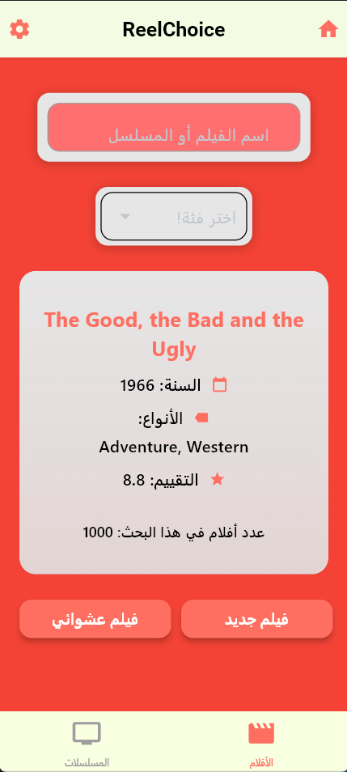
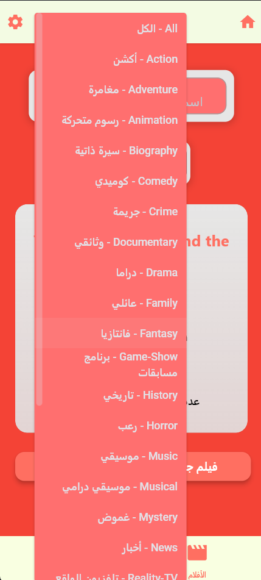
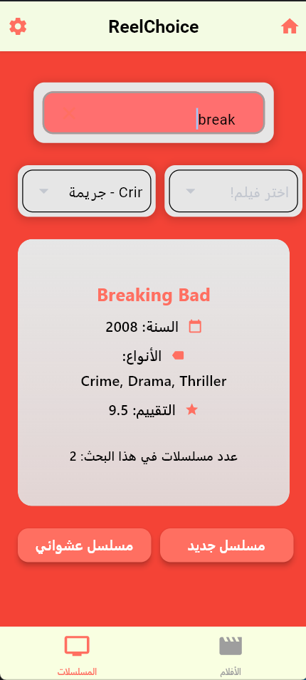

# 🎬 Movie & Series Picker - تطبيق اختيار فيلم أو مسلسل عشوائي

<div align="center">
  
  <br><br>
  <b>تطبيق ذكي لاختيار فيلم أو مسلسل عشوائي، مع بحث فوري، اقتراحات تلقائية، وتصميم جذاب باستخدام Flet.</b>
  <br><br>

  
  
</div>

---

## 📖 نظرة عامة (Overview)

**Movie & Series Picker** هو تطبيق مكتبي تم تطويره باستخدام **Flet** (Python)،  
ويقدّم تجربة ممتعة لاختيار أفلام ومسلسلات بشكل عشوائي أو عبر البحث والتصفية حسب النوع.

يمتاز المشروع بـ:

- بحث فوري مع *اقتراحات تلقائية (Auto Suggestions)*  
- اختيار عشوائي ذكي بضغط زر  
- قاعدة بيانات محلية لكل من **movies.db** و **series.db**  
- تصميم أنيق ومحاذاة RTL كاملة للغة العربية  
- واجهة تفاعلية وسهلة الاستخدام  

---

## ✨ المميزات الرئيسية (Key Features)

- 🔍 **بحث لحظي (Real-Time Search)** مع اقتراحات فورية.
- 🎬 **اختيار عشوائي** لفيلم أو مسلسل حسب النوع أو بدون تصفية.
- 🎭 **تصفية حسب النوع (Genre Filter)** مع أكثر من 25 نوع.
- 🗂 **SQLite Database** منفصلة للأفلام والمسلسلات.
- 🌙 **واجهة حديثة وداعمة للغة العربية بالكامل (RTL)**.
- 🎨 **تصميم جذاب** باستخدام Flet + ألوان وتأثيرات ظلية.

---

## 📸 لقطات شاشة (Screenshots)

| الواجهة الرئيسية | تصفية حسب النوع | البحث + الاقتراحات |
|:---:|:---:|:---:|
|  |  |  |

  
---

## 🚀 تشغيل التطبيق (Getting Started)

### 1️⃣ تثبيت المكتبات المطلوبة

```bash
pip install flet
```

*(المشروع لا يحتاج أي مكتبات خارجية أخرى غير Flet و SQLite المدمج مع Python)*

---

### 2️⃣ تشغيل التطبيق

```bash
python main.py
```

---

## 🛠️ التقنيات المستخدمة (Tech Stack)

- **Language:** Python 3.x  
- **GUI Framework:** Flet  
- **Database:** SQLite (movies.db + series.db)  
- **Design:** Custom Theme, RTL Support, Gradients & Shadows  

---

---

<div align="center">
  Developed with ❤️ by <b>Salah Abdeldaim</b>
</div>
